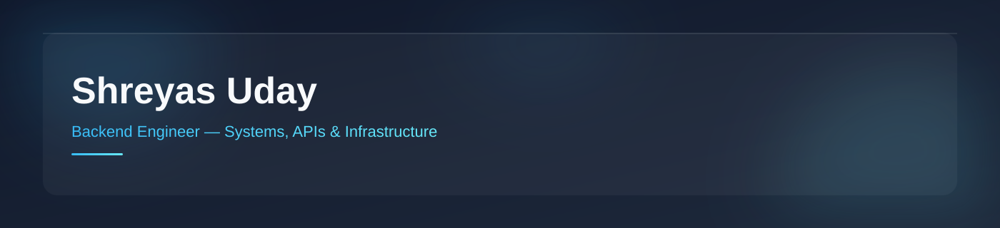

  

 

   

 

> Everything I build is public by default: not released after the fact, developed in the open from the first commit.

`DeployStation`, `ReccoFlix`, `MoodTune`, and `JobTrackr` are all public repositories, not private projects with a polished repo bolted on afterward.

**Current focus**: backend infrastructure and developer tooling: PaaS platforms, deployment pipelines, and the APIs that sit underneath them, mostly in TypeScript/Node.js and Python.

**Where this is headed**: moving from "my repos are public" to actually contributing to projects I use daily. The goal isn't a contributions graph that looks busy; it's a first meaningful PR to an infra or dev-tooling project this year.

**Why**: the parts of engineering I find most interesting (deployment systems, container orchestration, API boundaries) are exactly the parts open source does best. You get to see how other people solved the same infrastructure problem, and where they were wrong about it.

---

<table>
<tr>
<td width="33%" valign="top">

**Languages**

</td>
<td width="33%" valign="top">

**Backend**

</td>
<td width="33%" valign="top">

**Databases**

</td>
</tr>
<tr>
<td width="33%" valign="top">

**Cloud & Infra**

</td>
<td width="33%" valign="top">

**Tooling**

</td>
<td width="33%" valign="top">

**Frontend** (exploring)

</td>
</tr>
</table>

---

Not a separate specialty: AI shows up in my backend work where it earns its place.

- **LLM APIs**: Groq-hosted Llama 3.3 70B as the recommendation engine behind `ReccoFlix`
- **RAG & Vector Retrieval**: LlamaIndex + ChromaDB on a team legal-AI project (case analysis over LLaMA 3.1)
- **Inference Pipelines**: Python ML pipeline behind `MoodTune`, served through a dedicated FastAPI microservice
- **Prompt & API Integration**: designing backend services that treat an LLM API as just another dependency to wrap, rate-limit, and fail gracefully around

---

<b>DeployStation</b>: PaaS deployment engine for Node.js apps

 

**Problem**: Deploying a small Node.js app shouldn't require provisioning a server, installing a runtime, and babysitting a process by hand. DeployStation compresses "push to GitHub" into "get a live URL."

**Architecture**: A layered REST API (Controller → Service, deliberately not MVC) sits in front of Docker. Each deployment gets its own isolated container, tracked through a 4-state lifecycle: `pending → building → live → failed`. Runs on a single AWS EC2 instance with per-deployment subdomain generation and GitHub OAuth for auth.

**Interesting engineering decision**: Keeping the Controller and Service layers strictly separate (instead of folding logic into route handlers) made the lifecycle state machine testable on its own, which mattered once "building" started branching into more failure modes than expected.

**Challenges & trade-offs**: Status updates currently run on polling, not push-based updates. That's a known, deliberate trade-off: simple to reason about, but it won't hold up past a handful of concurrent deployments. Moving to SSE/WebSockets is next, not a someday-maybe.

**Lessons learned**: Socket.io and Node's built-in `EventEmitter` solve different problems (transport vs. in-process events). Treating them as interchangeable early cost some rework once real-time tracking became a real requirement instead of a nice-to-have.

**Repository**: [github.com/ShreyasUday/DeployStation](https://github.com/ShreyasUday/DeployStation)

<b>ReccoFlix</b>: AI-powered anime recommendation system

 

**Problem**: Anime discovery across Kitsu and MyAnimeList/Jikan is fragmented: two APIs, two data shapes, no single "what should I watch next."

**Architecture**: A Node.js + Prisma backend normalizes both sources into one PostgreSQL schema, then hands the recommendation step to Groq's hosted Llama 3.3 70B. Deployed on EC2 behind Nginx, kept alive with PM2.

**Interesting engineering decision**: Using Groq specifically for inference (over a slower general-purpose LLM host) keeps recommendation latency low enough that it doesn't feel like a "wait for the AI" step.

**Challenges & trade-offs**: Reconciling two external APIs with different metadata conventions into one schema means accepting that some data will always be slightly stale relative to either source individually.

**Lessons learned**: Designing the schema around what the recommender actually needs (rather than mapping each API's response shape 1:1 into the database) held up better as both sources evolved.

**Repository**: [github.com/ShreyasUday/ReccoFlix](https://github.com/ShreyasUday/ReccoFlix)

<b>MoodTune</b>: mood-based music recommendation system

 

**Problem**: Turning something subjective ("I'm in this kind of mood") into a concrete, ranked list of songs.

**Architecture**: A Python ML pipeline classifies mood, exposed through a FastAPI microservice that a full-stack web app calls for recommendations.

**Interesting engineering decision**: Separating the ML pipeline from the web app behind a dedicated FastAPI boundary kept the recommendation logic swappable without touching the frontend.

**Challenges & trade-offs**: Mood is fuzzy input by nature; the trade-off sits between a simple, fast classifier and a slower, more nuanced one.

**Repository**: [github.com/ShreyasUday/MoodTune-Mood-Based-Music-Recommendation-System](https://github.com/ShreyasUday/MoodTune-Mood-Based-Music-Recommendation-System)

<b>JobTrackr</b>: job application tracker (backend + Android)

 

**Problem**: Job hunting generates more state (applied, interviewing, ghosted, offer) than a spreadsheet comfortably tracks, especially from a phone.

**Architecture**: FastAPI + PostgreSQL backend, Celery/Redis for background work, paired with a native Android client in Kotlin + Jetpack Compose.

**Interesting engineering decision**: Offloading background work to Celery/Redis instead of running it inline keeps the API responsive even while a reminder or status check is running.

**Challenges & trade-offs**: Maintaining a native Android client alongside the backend roughly doubles the surface area to keep in sync: a deliberate trade for a real on-the-go experience over a mobile web view.

**Repository**: *add your repo link here*

---

> Currently interviewing for SDE and backend engineering internships. This section will list real roles as they're confirmed, not before.

---

 

&nbsp;&nbsp;

---

 

  

---

---

<picture>
  <source media="(prefers-color-scheme: dark)" srcset="https://raw.githubusercontent.com/Platane/Platane/output/github-contribution-grid-snake-dark.svg" />
  
</picture>

---

<table>
<tr>
<td width="33%" valign="top">

**Learning & Systems**
- **Distributed Queues**: Redis & Celery pattern design
- **CI/CD Automation**: GitHub Actions deployment pipelines
- **Systems Language**: Go for high-concurrency microservices

</td>
<td width="33%" valign="top">

**Active Builds**
- **DeployStation**: Upgrading polling to SSE & WebSockets
- **ReccoFlix**: Expanding multi-source recommendation coverage

</td>
<td width="33%" valign="top">

**Exploring & Researching**
- **Applied RAG**: Vector indexing & LLaMA 3 pipelines
- **Architecture**: Distributed system design write-ups
- **Open Source**: First core infra & dev-tooling PR

</td>
</tr>
</table>

---

   

 

Ship it. Monitor it. Make it boring.

